# OAuth 2.0 Sequence Diagram

## Overview

This document provides a comprehensive sequence diagram for the OAuth 2.0 authentication flow implemented in the GLX Civic Networking App. The system supports multiple OAuth providers: Google, GitHub, Facebook, and Twitter.

## OAuth 2.0 Flow Sequence Diagram

```mermaid
sequenceDiagram
    participant User as User/Browser
    participant Client as GLX Client App
    participant Server as GLX Auth Server
    participant StateStore as OAuth State Store
    participant DB as Database
    participant Provider as OAuth Provider<br/>(Google/GitHub/Facebook/Twitter)

    %% OAuth Initialization Phase
    Note over User,Provider: OAuth 2.0 Authorization Code Flow - Initialization
    User->>Client: Click "Login with [Provider]"
    Client->>Server: POST /api/auth/oauth/init<br/>{provider: "google"}
    
    Server->>Server: Validate provider
    Server->>Server: generateOAuthState()<br/>(Crypto-secure 64 char hex)
    Server->>StateStore: storeOAuthState(state)<br/>(Store with timestamp)
    StateStore-->>Server: State stored (10 min TTL)
    Server-->>Client: {state, provider}
    
    Client->>Client: Construct OAuth URL<br/>(redirect_uri, client_id, scope, state)
    Client->>User: Redirect to OAuth provider
    
    %% OAuth Provider Authorization Phase
    Note over User,Provider: User Authorization at Provider
    User->>Provider: Login & authorize app
    Provider->>Provider: User authenticates
    Provider->>Provider: Generate authorization code
    Provider-->>Client: Redirect to callback URL<br/>(code, state)
    
    %% OAuth Callback & Token Exchange Phase
    Note over User,Provider: OAuth Callback & Token Exchange
    Client->>Client: Extract code & state from URL
    Client->>Provider: Exchange code for tokens<br/>(client_id, client_secret, code)
    Provider-->>Client: {access_token, refresh_token,<br/>user_profile}
    
    Client->>Server: POST /api/auth/oauth/callback<br/>{provider, code, state, providerData}
    
    %% State Validation
    Server->>StateStore: validateOAuthState(state)
    StateStore->>StateStore: Check state exists<br/>& not expired (10 min)
    StateStore->>StateStore: Delete state (one-time use)
    StateStore-->>Server: {valid: true}
    
    alt Invalid State
        Server-->>Client: Error: Invalid OAuth state<br/>(CSRF protection)
        Client-->>User: Show error message
    end
    
    %% User Lookup & Creation Phase
    Note over Server,DB: User Identification & Creation
    Server->>DB: findUserByOAuth(provider, providerId)
    
    alt Existing OAuth Account
        DB-->>Server: userId found
        Server->>DB: linkOAuthAccount()<br/>(Update tokens & profile)
        DB-->>Server: Account updated
        Note over Server: isNewUser = false
    else No OAuth Account Found
        Server->>DB: SELECT user by email
        alt Email Exists
            DB-->>Server: userId found
            Server->>DB: linkOAuthAccount()<br/>(Link OAuth to existing user)
            DB-->>Server: OAuth linked
            Note over Server: isNewUser = false
        else New User
            Server->>DB: INSERT INTO users<br/>(email, username, email_verified=1)
            DB-->>Server: New userId created
            Server->>DB: INSERT INTO oauth_accounts<br/>(userId, provider, tokens)
            DB-->>Server: OAuth account linked
            Note over Server: isNewUser = true
        end
    end
    
    %% JWT Token Generation
    Note over Server: JWT Token Generation
    Server->>Server: generateToken(userId)<br/>(Access Token: 15 min expiry)
    Server->>Server: generateRefreshToken(userId)<br/>(Refresh Token: 7 days expiry)
    Server->>Server: trackUserAction(oauth_login/oauth_registration)
    
    Server-->>Client: {token, refreshToken,<br/>userId, isNewUser, provider}
    Client->>Client: Store tokens in localStorage
    Client-->>User: Redirect to dashboard<br/>(Login successful)

    %% Token Refresh Flow (Optional)
    Note over Client,Server: Optional: Token Refresh Flow
    Client->>Server: POST /api/auth/refresh<br/>{refreshToken}
    Server->>Server: verifyRefreshToken()
    Server->>Server: Check token not blacklisted
    Server->>Server: rotateRefreshToken()<br/>(Blacklist old, generate new)
    Server-->>Client: {token, refreshToken}<br/>(New tokens)

    %% Session Management
    Note over User,DB: Session & Account Management
    User->>Client: View OAuth accounts
    Client->>Server: GET /api/auth/oauth/accounts<br/>Authorization: Bearer token
    Server->>DB: getUserOAuthAccounts(userId)
    DB-->>Server: List of linked providers
    Server-->>Client: {accounts: [...]}
    Client-->>User: Display linked accounts

    User->>Client: Unlink OAuth provider
    Client->>Server: DELETE /api/auth/oauth/{provider}<br/>Authorization: Bearer token
    Server->>DB: unlinkOAuthAccount(userId, provider)
    DB-->>Server: Account unlinked
    Server-->>Client: Success message
    Client-->>User: Provider unlinked
```



## Flow Components

### 1. OAuth Initialization (`/api/auth/oauth/init`)
- **Purpose**: Generate CSRF-protected state token
- **Input**: Provider name (google, github, facebook, twitter)
- **Output**: Cryptographically secure state token (64 character hex)
- **Security**: 
  - State stored in memory with 10-minute TTL
  - Automatic cleanup of expired states
  - One-time use validation

### 2. OAuth Callback (`/api/auth/oauth/callback`)
- **Purpose**: Handle OAuth provider callback and authenticate user
- **Input**: 
  - Authorization code from provider
  - State token for CSRF validation
  - Provider user data (providerId, email, name)
  - Access/refresh tokens from provider
- **Security Features**:
  - State validation prevents CSRF attacks
  - State is single-use and time-limited
  - Provider data validation
  
### 3. User Management
- **Existing OAuth Account**: Updates tokens and profile information
- **Existing Email**: Links OAuth provider to existing user account
- **New User**: 
  - Creates user account with OAuth data
  - Sets email_verified=1 (trusts OAuth provider)
  - Initializes with default roles and balances
  - Links OAuth account immediately

### 4. Token Generation
- **Access Token**: JWT with 15-minute expiration
- **Refresh Token**: JWT with 7-day expiration
- **Token Rotation**: Old refresh tokens are blacklisted on refresh
- **Blacklisting**: Tokens can be immediately revoked on logout

### 5. Multi-Provider Support
- Users can link multiple OAuth providers to one account
- View all linked providers via `/api/auth/oauth/accounts`
- Unlink providers via `/api/auth/oauth/:provider`
- Each provider stored separately in `oauth_accounts` table

## Database Schema

### oauth_accounts Table
```sql
CREATE TABLE oauth_accounts (
  id INTEGER PRIMARY KEY AUTOINCREMENT,
  user_id INTEGER NOT NULL,
  provider TEXT NOT NULL, -- 'google' | 'github' | 'facebook' | 'twitter'
  provider_id TEXT NOT NULL, -- Unique ID from OAuth provider
  provider_email TEXT, -- Email from OAuth provider
  provider_name TEXT, -- Display name from OAuth provider
  access_token TEXT, -- OAuth access token
  refresh_token TEXT, -- OAuth refresh token
  expires_at TEXT, -- Token expiration timestamp
  created_at TEXT NOT NULL,
  updated_at TEXT NOT NULL,
  FOREIGN KEY (user_id) REFERENCES users(id),
  UNIQUE(provider, provider_id)
);
```

## Security Features

### CSRF Protection
- Cryptographically secure state tokens (64-char hex from 32 random bytes)
- State stored with timestamp for 10-minute expiration
- One-time use: State deleted after validation
- Automatic cleanup of expired states

### Token Security
- JWT tokens use HS256 signing
- Access tokens: 15-minute expiration (short-lived)
- Refresh tokens: 7-day expiration
- Token rotation on refresh (old tokens blacklisted)
- Immediate revocation via blacklist

### Account Linking
- Prevents duplicate OAuth accounts across users
- Links to existing users by email when possible
- Validates OAuth provider responses
- Trusts OAuth provider email verification

### Rate Limiting
- OAuth endpoints protected by `authLimiter`
- Prevents brute force and abuse
- Per-IP rate limiting

## Production Deployment Notes

⚠️ **Important for Production with Load Balancers/Multiple Instances:**

The current implementation uses in-memory storage for OAuth state, which works for:
- Development environments
- Single-instance deployments
- Deployments without load balancers

For production with multiple instances, migrate to **Redis** or **database storage**:

```typescript
// Redis implementation example
await redis.setex(`oauth:state:${state}`, 600, JSON.stringify({ 
  timestamp: Date.now()
}));
```

This ensures OAuth state is accessible across all server instances for callback handling.

## Supported OAuth Providers

| Provider | Status | Features |
|----------|--------|----------|
| Google | ✅ Supported | Email, profile |
| GitHub | ✅ Supported | Email, username |
| Facebook | ✅ Supported | Email, name |
| Twitter | ✅ Supported | Username, profile |

## API Endpoints Summary

| Endpoint | Method | Auth Required | Description |
|----------|--------|---------------|-------------|
| `/api/auth/oauth/init` | POST | No | Initialize OAuth flow, get state token |
| `/api/auth/oauth/callback` | POST | No | Handle OAuth callback, authenticate user |
| `/api/auth/oauth/accounts` | GET | Yes | Get user's linked OAuth accounts |
| `/api/auth/oauth/:provider` | DELETE | Yes | Unlink OAuth provider |

## Error Handling

- **Invalid provider**: 400 Bad Request
- **Invalid state**: 401 Unauthorized (CSRF protection)
- **Missing provider data**: 400 Bad Request
- **Failed OAuth link**: 500 Internal Server Error
- **Provider not found for unlink**: 404 Not Found

## Related Documentation

- [Auth System README](../GLX_App_files/server/AUTH_SYSTEM_README.md)
- [Security Architecture](../SECURITY_ARCHITECTURE.md)
- [Implementation Guide](../GLX_App_files/AUTH_SYSTEM_COMPLETE.md)
